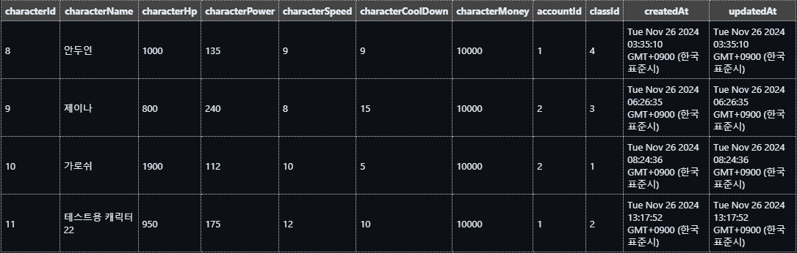
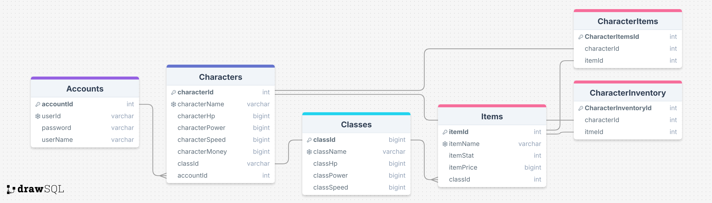
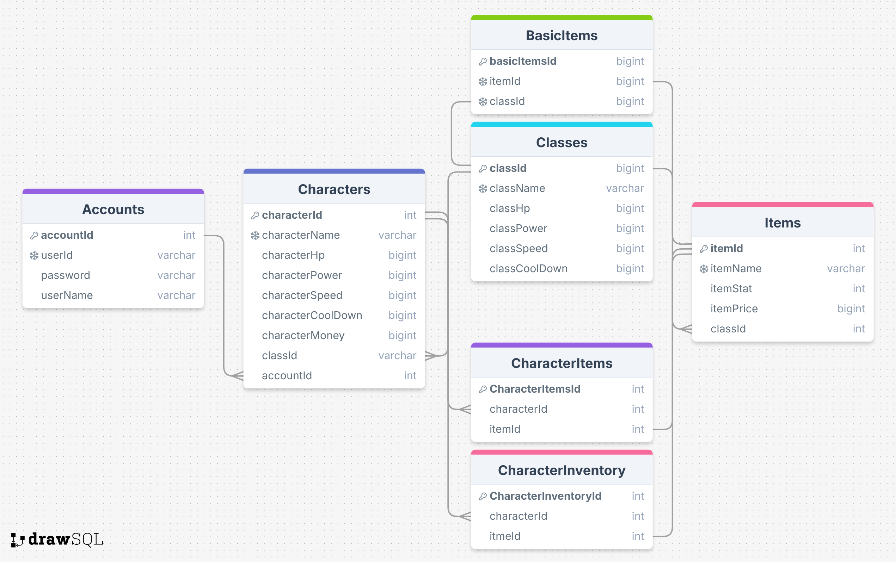

# 『 프로젝트 - 아이템 시뮬레이터 』

## 소개하기에 앞서...

1. Insomnia 폴더 안에 들어있는 json 파일을 Insomnia 콜렉션에 import해주세요!
2. 운영자 계정의 ID와 비밀번호 아래와 같습니다.

```
"userId": "fakerfan10"
"password": "together1"
```

3. ./src/jsons폴더 안에 이 프로젝트의 클래스(직업)와 아이템들을 json 형식으로 작성해두었습니다. 편의상 만든 파일이고, fs로 읽어들이는 용도는 아닙니다.
4. accountId는 로그인 성공 시 확인할 수 있습니다.
5. 계정별 캐릭터 목록을 조회하시면 계정이 소유한 캐릭터의 id를 확인할 수 있습니다.

## 프로젝트 소개

Node.js의 express 모듈, RDBMS(MySQL)을 활용하여 아이템 시뮬레이터를 만들어 봅시다. 이 프로젝트에서 필수로 구현해야 하는 기능은 아래와 같습니다.

- 계정 생성(회원가입)
- 로그인
- 캐릭터 생성
- 캐릭터 삭제
- 캐릭터 상세 조회
- 아이템 생성
- 아이템 수정
- 아이템 목록 조회
- 아이템 상세 조회

## 프로젝트 컨셉

캐릭터 생성 시, 반드시 클래스(직업)를 선택하게끔 API를 구현했습니다. 각 클래스마다 서로 다른 스탯을 가지고 있습니다.

```JSON
"class1": {
    "className": "전사",
    "classHp": 1000,
    "classPower": 100,
    "classSpeed": 10,
    "classCoolDown": 5
  },
  "class2": {
    "className": "도적",
    "classHp": 700,
    "classPower": 110,
    "classSpeed": 12,
    "classCoolDown": 10
  },
  "class3": {
    "className": "마법사",
    "classHp": 800,
    "classPower": 120,
    "classSpeed": 8,
    "classCoolDown": 15
  },
  "class4": {
    "className": "사제",
    "classHp": 900,
    "classPower": 90,
    "classSpeed": 9,
    "classCoolDown": 9
  }
```

처음 생성된 캐릭터는 각 클래스의 기본 아이템을 착용하게 됩니다.

```JSON
"item1": {
    "itemCode": 1,
    "itemName": "강철심장",
    "itemStat": { "hp": 900, "power": 12 },
    "itemPrice": 3000,
    "classId": 1
  },
  "item2": {
    "itemCode": 2,
    "itemName": "밤의 끝자락",
    "itemStat": { "hp": 250, "power": 65 },
    "itemPrice": 3000,
    "classId": 2
  },
  "item3": {
    "itemCode": 3,
    "itemName": "라바돈의 죽음 모자",
    "itemStat": { "power": 120 },
    "itemPrice": 3600,
    "classId": 3
  },
  "item4": {
    "itemCode": 4,
    "itemName": "불타는 향로",
    "itemStat": { "hp": 100, "power": 45, "speed": 4 },
    "itemPrice": 2200,
    "classId": 4
  }
```

즉, `초기 캐릭터의 스탯`은 `클래스 기본 스탯` + `기본 장착 아이템 스탯` 값을 가지게 됩니다.</br></br>
(예시 이미지)


# 개발 체크리스트

## 프로젝트 관리

- [x] `.env` 파일을 이용해서 민감한 정보(DB 계정 정보, API Key 등)를 관리 ✅ 2024-11-25
- [x] `.gitignore` 파일을 생성하여 `.env` 파일과 `node_modules` 폴더가 Github에 올라가지 않도록 설정 ✅ 2024-11-25
- [x] `.prettierrc` 파일을 생성 ✅ 2024-11-25

## AWS EC2 배포

- [x] EC2 인스턴스 생성
- [x] 도메인 연결
      -> 연결엔 성공했으나 API를 프론트엔드로 구현하는 단계까진 수행하지 못했습니다.

## 인증 미들웨어 구현

- [x] Request의 Authorization 헤더에서 JWT를 가져와서 사용자 인증 검사 ✅ 2024-11-26
- [x] Authorization에 담겨 있는 값의 형식이 표준(Bearer JWT Value)과 일치하지 않는 경우 인증 실패! ✅ 2024-11-26
- [x] JWT의 유효기한이 지난 경우 인증 실패! ✅ 2024-11-26
- [x] JWT 검증(JWT Secret 불일치, 데이터 조작으로 인한 Signature 불일치 등)에 실패한 경우 인증 실패! ✅ 2024-11-26
- [x] 인증에 성공하는 경우에는 req.locals.user에 인증된 사용자 정보를 담고서 남은 미들웨어를 진행한다. ✅ 2024-11-26

## 데이터베이스 모델링

Accounts : 사용자 계정 테이블
Characters : 계정이 생성한 캐릭터 테이블
Items : 아이템 테이블
Classes : 캐릭터 클래스(직업) 테이블
BasicItems : 클래스별 기본 아이템 테이블(아이템 테이블 참조)
CharactersItems : 캐릭터가 장착하고 있는 아이템 테이블(아이템 테이블 참조)
CharactersInventory : 캐릭터가 보유하고 있는 아이템 테이블(아이템 테이블 참조)

- 초기 모델링
  
- 업데이트된 모델링
  
- 모델링 최종 형태(DBeaver 관계도)
  

## API 구현하기

### 계정 생성(회원 가입) API

- [x] req.body로부터 id, 비밀번호, 비밀번호 확인, 이름을 넘겨 받는다. ✅ 2024-11-25
- [x] 비밀번호는 해싱해서 저장한다. ✅ 2024-11-25
- [x] ID : 영어 소문자+숫자 조합(중복 불가) ✅ 2024-11-25
- [x] 비밀 번호 : 최소 6자 이상(특별한 기준이 없어서 ID와 같은 기준을 적용했다.) ✅ 2024-11-25
- [x] ID와 비밀번호에 대해 유효성 검사를 한다. ✅ 2024-11-25
- [x] 예외 발생 시, HTTP 상태코드와 에러 메세지를 반환한다. ✅ 2024-11-25

### 로그인 API

- [x] req.body로부터 id, 비밀번호를 넘겨 받는다. ✅ 2024-11-26
- [x] 아이디가 존재하는지 검사 ✅ 2024-11-26
- [x] 아이디에 대응하는 비밀번호인지 검사 ✅ 2024-11-26
- [x] 예외 발생 시, HTTP 상태코드와 에러 메세지를 반환한다. ✅ 2024-11-26
- [x] 로그인에 성공하면 accessToken을 생성하여 반환한다. ✅ 2024-11-26

### 클래스 생성 API

- [x] 클래스 이름, 클래스 체력, 클래스 전투력, 클래스 스피드, 클래스 쿨다운을 request로 전달받기 ✅ 2024-11-26
- [x] 운영자 권한 검사 ✅ 2024-11-26
- [x] 데이터 유효성 검사 ✅ 2024-11-26
- [x] 캐릭터 이름이 중복되는지 검사 ✅ 2024-11-26
- [x] 예외 발생 시, HTTP 상태코드와 에러 메세지를 반환 ✅ 2024-11-26
- [x] 새로운 클래스 데이터를 생성 ✅ 2024-11-26
- [x] 메시지와 함께 생성한 클래스 데이터 반환 ✅ 2024-11-26

### 아이템 생성 API

- [x] 아이템 코드, 이름, 스탯, 가격을 request로 전달받기 ✅ 2024-11-26
- [x] 데이터 유효성 검사 ✅ 2024-11-26
- [x] 새로운 아이템 데이터 생성 ✅ 2024-11-26
- [x] 예외 발생 시, HTTP 상태코드와 에러 메세지를 반환 ✅ 2024-11-26
- [x] 메시지와 함께 생성한 아이템 데이터(json) 반환 ✅ 2024-11-26

### 아이템 수정 API

- [x] 아이템 코드는 URI의 parameter로 전달 ✅ 2024-11-26
- [x] 아이템 명, 아이템 능력을 request로 전달 ✅ 2024-11-26
- [x] 운영자 권한 검사, 유효성 검사 ✅ 2024-11-26
- [x] 수정된 아이템 데이터를 json 형식으로 반환 ✅ 2024-11-26
- [x] 예외 발생 시, HTTP 상태코드와 에러 메세지를 반환한다. ✅ 2024-11-26

### 아이템 목록 조회 API

- [x] 아이템 코드, 아이템 명, 아이템 가격 조회 ✅ 2024-11-26
- [x] 아이템 목록을 json 형식으로 반환 ✅ 2024-11-26
- [x] 예외 발생 시, HTTP 상태코드와 에러 메세지를 반환한다. ✅ 2024-11-26

### 아이템 상세 조회 API

- [x] 아이템 코드를 URI의 parameter로 전달 받아 아이템 코드, 아이템 명, 아이템 능력, 아이템 가격을 조회 ✅ 2024-11-26
- [x] 상세 조회한 아이템 데이터를 json 형식으로 반환 ✅ 2024-11-26
- [x] 예외 발생 시, HTTP 상태코드와 에러 메세지를 반환한다. ✅ 2024-11-26

### 클래스별 기본 아이템 생성 API

- [x] 아이템 id, 클래스 id를 request로 전달받기 ✅ 2024-11-26
- [x] 데이터 유효성 검사 ✅ 2024-11-26
- [x] 운영자 권한 검사 ✅ 2024-11-26
- [x] 새로운 기본 아이템 생성 ✅ 2024-11-26
- [x] 예외 발생 시, HTTP 상태코드와 에러 메세지를 반환한다. ✅ 2024-11-26
- [x] 메시지와 함께 생성한 기본 아이템 데이터 반환 ✅ 2024-11-26

### 캐릭터 생성 API(JWT 인증)

- [x] req.body로부터 캐릭터 이름, 클래스Id를 넘겨 받는다. ✅ 2024-11-26
- [x] authMiddleware를 통해 jwt 인증을 거치고 사용자 데이터를 받는다. ✅ 2024-11-26
- [x] 캐릭터 이름 유효성 검사(공백 포함 15글자 이하만 가능, 공백만 입력했을 경우, 입력하지 않은 것으로 처리, 중복 불가) ✅ 2024-11-26
- [x] 클래스 유효성 검사(선택한 클래스가 Class DB에 존재하는가?) ✅ 2024-11-26
- [x] 예외 발생 시, HTTP 상태코드와 에러 메세지를 반환한다. ✅ 2024-11-26
- [x] 선택한 클래스에 따라 캐릭터가 착용할 기본 아이템을 생성하고, 장착한 뒤, 그에 따른 스탯을 부여한다. ✅ 2024-11-26

### 캐릭터 삭제 API(JWT 인증)

- [x] 삭제할 캐릭터의 ID는 URI의 parameter로 전달 ✅ 2024-11-26
- [x] authMiddleware를 통해 jwt 인증을 거치고 사용자 데이터를 받는다 ✅ 2024-11-26
- [x] 유효성 검사 + 계정이 소유한 캐릭터가 맞는지 검사 ✅ 2024-11-26
- [x] 일치한다면 캐릭터 삭제 ✅ 2024-11-26
- [x] 예외 발생 시, HTTP 상태코드와 에러 메세지를 반환한다. ✅ 2024-11-26

### 캐릭터 상세 조회 API

- [x] 캐릭터의 ID를 URI의 parameter로 전달 ✅ 2024-11-26
- [x] 유효성 검사 ✅ 2024-11-26
- [x] 캐릭터 이름과 여러 스탯을 전달 ✅ 2024-11-26
- [x] 플레이어가 유효한 token을 가지고 있고 , 본인의 캐릭터를 조회한다면 게임 머니까지 조회 ✅ 2024-11-26
- [x] 예외 발생 시, HTTP 상태코드와 에러 메세지를 반환한다. ✅ 2024-11-26

## 도전 기능

- [x] 아이템 구입 API ✅ 2024-11-28
- [x] 아이템 판매 API ✅ 2024-11-28
- [x] 캐릭터가 보유한 인벤토리 내 아이템 목록 조회 API ✅ 2024-11-28
- [x] 캐릭터가 장착한 아이템 목록 조회 API ✅ 2024-11-28
- [x] 아이템 장착 API ✅ 2024-11-28
- [x] 아이템 장착 해제 API ✅ 2024-11-28
- [x] 게임 머니를 버는 API ✅ 2024-11-28

## 개념 정리 QnA

1. **암호화 방식**</br>
   Q. _비밀번호를 DB에 저장할 때 Hash를 이용했는데, Hash는 단방향 암호화와 양방향 암호화 중 어떤 암호화 방식에 해당할까요?_</br>
   A. Hash는 단방향 암호화 방식에 해당합니다. 원본 데이터를 고정된 길이의 다른 데이터로 변환한 뒤, 다시 복호화할 수 없기 때문입니다. 따라서 비밀번호를 검증하려면 해당 비밀번호를 다시 Hashing한 값과 비교해야 합니다.</br></br>
   Q. _비밀번호를 그냥 저장하지 않고 Hash 한 값을 저장 했을 때의 좋은 점은 무엇인가요?_</br>
   A. 서버 데이터베이스에 사용자의 비밀번호를 Hash한 값으로 저장한다면, 그 값이 유출되더라도 사용자의 개인정보를 보호할 수 있습니다.</br></br>
2. **인증 방식**</br>
   Q. _JWT(Json Web Token)을 이용해 인증 기능을 했는데, 만약 Access Token이 노출되었을 경우 발생할 수 있는 문제점은 무엇일까요?_</br>
   A. 토큰은 암호화 방식이 아니라 데이터 표현방식의 하나일 뿐이므로 누구든 그 내용을 다시 해석할 수 있습니다. 따라서 중요한 정보를 토큰으로 전달했다면 유출될 위험이 있습니다. 또 토큰을 통해 인증과 인가가 이루어지는 API일 경우, 서비스의 오남용이 우려될 것입니다.</br></br>
   Q. 해당 문제점을 보완하기 위한 방법으로는 어떤 것이 있을까요?</br>
   A. 유효 기간이 매우 짧은 Access Token을 Refresh Token을 통해 갱신하거나 세션 방식을 혼용할 수 있습니다. 예를 들어 계정을 처음 생성할 때 중요한 정보들을 세션 DB에 저장해두고, 평소엔 토큰 방식으로 인증을 진행할 수 있습니다. 중요한 정보가 담긴 Access Token은 빠르게 만료되겠지만, 남은 Refresh Token을 통해 계속 갱신될 수 있습니다. 하지만 사용자가 장기간 미접속하여 Refresh Token까지 만료된다면 재로그인을 요구하고, 이때 세션DB에 저장해두었던 데이터와 비교한 뒤 다시 토큰을 발행하는 방식입니다.</br></br>
3. **인증과 인가**</br>
   Q. 인증과 인가가 무엇인지 각각 설명해 주세요.</br>
   A. 인증은 요청된 데이터를 바탕으로 사용자가 누구인지 검증하는 과정입니다. 인가 과정에서는 사용자의 인증 여부, 혹은 역할에 따라 특정 자원에 대한 권한을 부여하거나 차단시킬 수 있습니다.</br></br>
   Q. 위 API 구현 명세에서 인증을 필요로 하는 API와 그렇지 않은 API의 차이가 뭐라고 생각하시나요?</br>
   해당 API를 사용했을 때 중요한 데이터를 변질시킬 우려가 높을수록 인증을 필요로 한다고 생각합니다. 다분히 표면적인 정보들은 누구나 조회해도 괜찮습니다. 예를 들어 서울의 지하철 노선도를 볼 수 있는 API가 있다면 누구에게든 공개되어도 문제가 되지 않을 것입니다. 하지만 특정 이용자가 몇월 며칠 어느 역에 얼마나 머물렀는지를 기록하는 API라면 아무에게나 공개되어선 안 되겠죠. 이런 데이터는 보다 까다로운 사용자 인증을 거쳐서 제공되어야 할 것입니다. 올해 유명 게임 회사의 전산 데이터가 유출되어서 이슈가 되었던 것처럼, 데이터의 접근 권한 탈취는 시스템 안정성에 커다란 위협을 야기합니다. </br></br>
   Q. 아이템 생성, 수정 API는 인증을 필요로 하지 않는다고 했지만 사실은 어느 API보다도 인증이 필요한 API입니다. 왜 그럴까요?</br>
   A. 데이터를 게시, 수정 혹은 삭제하는 API들은 2차, 3차 피해를 야기할 수 있으므로 인증을 필요로 해야 합니다. 악의적인 사용자가 이를 악용할 수 있기 때문입니다. 따라서, 사용자의 신원에 따라 차등적으로 권한을 부여하는 것이 필수적입니다.</br>
4. **Http Status Code**</br>
   Q. 과제를 진행하면서 사용한 Http Status Code를 모두 나열하고, 각각이 의미하는 것과 어떤 상황에 사용했는지 작성해 주세요.</br>

- 200 OK: 요청이 성공적으로 처리되었음을 나타냅니다. 일반적인 성공 응답에 사용합니다.
- 201 Created: 새로운 리소스가 성공적으로 생성되었음을 나타냅니다. 주로 POST 요청에 사용합니다.
- 400 Bad Request: 잘못된 요청 형식이나 파라미터가 포함되었음을 나타냅니다. 클라이언트 오류에 사용합니다.
- 401 Unauthorized: 인증이 필요하거나 인증이 실패했음을 나타냅니다. 보호된 API에 접근할 때 사용합니다.
- 403 Forbidden: 인증은 되었지만 권한이 없어 요청이 거부되었음을 나타냅니다. 인가 실패 시 사용합니다.
- 404 Not Found: 요청한 리소스가 존재하지 않음을 나타냅니다. 잘못된 URL 요청에 사용합니다.</br>
  (출처 : [HTTP 상태 코드 - HTTP | MDN](https://developer.mozilla.org/ko/docs/Web/HTTP/Status))

1. **게임 경제**</br>
   현재는 간편한 구현을 위해 캐릭터 테이블에 money라는 게임 머니 컬럼만 추가하였습니다.</br></br>
   Q. 이렇게 되었을 때 어떠한 단점이 있을 수 있을까요?</br>
   A. 만약 게임에서 사용되는 재화의 종류가 늘어난다면, 데이터 관리 측면에서 비효율적일 수 있습니다. 예를 들어 MMORPG 게임 같은 부분 유료화 게임의 경우 캐쉬와 골드로 나뉘는 게 일반적입니다. 또 모바일 게임의 경우엔 매우 다양한 종류의 이벤트 코인들이 생겼다가 사라지기도 합니다. 그리고 이 수많은 재화는 비슷한 로직에 따라 값이 증감될 것입니다. 게임 내 상품을 구매하기 위해 소비되므로, 여러 함수나 코드 조각을 공유하게 될 것입니다. 따라서 캐릭터의 정보가 주를 이루는 테이블 내부에서 재화들이 함께 관리되는 것은 코드의 복잡도를 높이거나 일관성을 해칠 수 있습니다.</br></br>
   Q. 이렇게 하지 않고 다르게 구현할 수 있는 방법은 어떤 것이 있을까요?</br>
   A. 재화와 비슷한 방식으로 사용되는 소모성 데이터들을 하나로 묶어서 테이블로 따로 만드는 게 좋다고 생각합니다. 이들은 게임의 기본 재화와 같은 함수나 메서드에 의해 처리될 가능성이 크므로, 한 테이블 내에서 관리되는 게 바람직할 것입니다.</br></br>
   Q. 아이템 구입 시에 가격을 클라이언트에서 입력하게 하면 어떠한 문제점이 있을 수 있을까요?</br>
   A. 유저가 자유롭게 가격을 정하는 경우는 일반적이지 않으므로 미리 제외하고 답변드리겠습니다. 만약, 어느 게임 서버의 API가 클라이언트로부터 가격을 직접 입력받게 된다면, 그 값이 DB에 저장되어 있는 아이템의 가격과 동일한 지 비교하고 싶을 것입니다. 이때 둘의 값이 같다면 아이템을 구매하는 로직을 수행하겠죠. 하지만 예외 처리가 완전하지 못했을 때, 의도한 형식이 아닌 데이터가 들어올 수 있습니다. 이를 테면 SQL 인젝션의 가능성이 있을 것입니다.

```JS
const { itemName, itemPrice, count } = req.body;

// MySQL
SELECT item
FROM item_table
WHERE itemName='itemName' AND itemPrice=' ' OR '1' = '1';

// 만약 itemPrice로 전달된 값이 'OR'1'=1이었다면?
// 그리고 이렇게 조회된 item이 그대로 함수의 인자로 사용되어서 악성 유저에게 전달된다면?
```

위와 같이 악용되는 사례를 고려한다면, 아이템의 가격을 직접 입력 받는 건 지양해야 합니다. 혹은 Prisma 같은 ORM(Object Relational Mapping)을 사용해서 SQL에 직접 접근하지 않는 방법도 유효할 것입니다.
